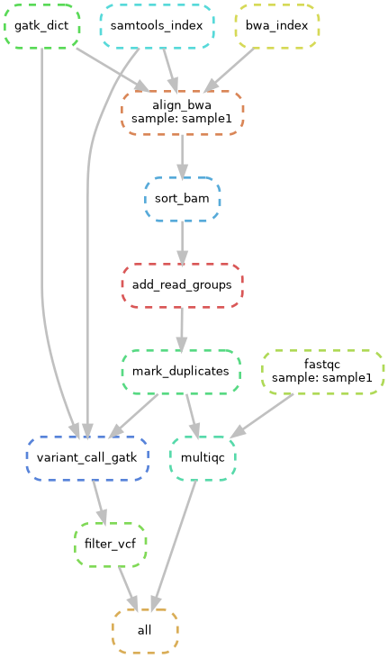

# WGS Variant Calling Pipeline

An automated **Whole Genome Sequencing (WGS)** variant calling pipeline built using **Snakemake**. This workflow processes raw sequencing data (FASTQ) through alignment, processing, and variant calling to produce high-quality variant files (VCF).

## Overview

This pipeline implements a standard GATK Best Practices workflow for germline variant calling. It handles:
1.  **Quality Control:** Raw data analysis with FastQC and MultiQC.
2.  **Alignment:** Mapping reads to the reference genome (GRCh38) using BWA-MEM.
3.  **Post-Alignment Processing:**
    * Sorting and Indexing (Samtools)
    * Read Group Assignment (GATK AddOrReplaceReadGroups)
    * Duplicate Marking (GATK MarkDuplicates)
4.  **Variant Calling:** Identifying SNPs and Indels using GATK HaplotypeCaller.
5.  **Filtering:** Hard filtering and compression using BCFtools.

## Tools & Technologies

The following bioinformatics tools are integrated into the pipeline:
* **Snakemake:** Workflow management and automation.
* **FastQC & MultiQC:** Quality control metrics.
* **BWA (Burrows-Wheeler Aligner):** Efficient alignment to the reference genome.
* **Samtools:** BAM file manipulation.
* **GATK4 (Genome Analysis Toolkit):** Variant discovery and genotyping.
* **BCFtools:** VCF manipulation and filtering.

## Clone the repository.

git clone [https://github.com/clousgospel/wgs-snakemake-pipeline.git](https://github.com/clousgospel/wgs-snakemake-pipeline.git)
cd wgs-snakemake-pipeline

## Dependencies and Installation

conda install -c bioconda -c conda-forge bwa samtools gatk4 fastqc multiqc bcftools snakemake ensembl-vep -y

## Data Requirements

Before analysis, ensure the following files are in the correct folders:
	data/sample1_R1.fastq.gz and data/sample1_R2.fastq.gz (Raw data)
	ref/Homo_sapiens.GRCh38.dna.primary_assembly.fa (Reference genome)
	
## Usage

snakemake --cores 4

## Outputs

Final Result:
	results/sample1/final.vcf.gz (Filtered Variants)
	
QC Report:
	qc/multiqc/multiqc_report.html

## Dataset & Acknowledgements

This project was developed and validated using open-source test data provided by the **Hartwig Medical Foundation**.

* **Data Source:** [Hartwig Medical Test Data](https://github.com/hartwigmedical/testdata)

> **Note:** This pipeline is intended for educational and research purposes.# wgs-snakemake-pipeline
